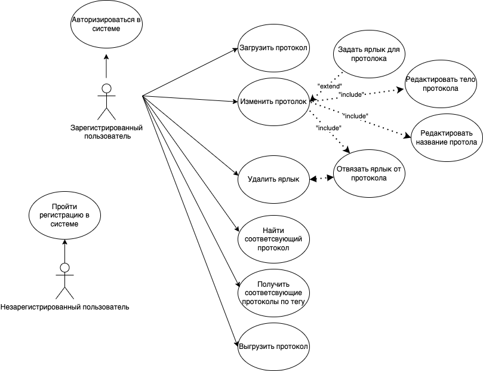
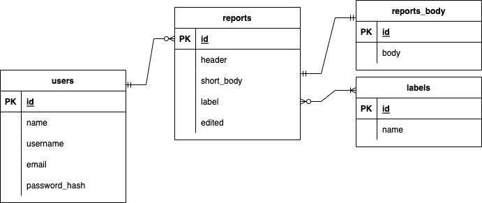

## Reports System - Система протоколирования встреч и собраний

## Цель работы

Корректный процесс проведения проведения собраний и встреч внутри коммерческих и государственных организаций является одной из ключевых задач во время разработки проектов в различных сферах.

Многие организации, в особенности государственные, ведут собственные системы организации, конроля и учета встреч и собраний.

Каждое специализированное программное решение было разработано и продолжает модифицироваться специально для конкретного предприятия. Причем доступ предоставляется только для членов той или иной организации.

Интерфейс программных решений позволяет при наличие соответствующего уровня доступа получить нужную выгрузку данных о той или иной встрече/заседании.

Все существующие решения не имеют возможности их использовать под все задачи без учета специфики сфера.

**Цель данной работы** – программное обеспечение (далее RS - Reports System) для сбора, хранения, обновления, учета и категоризации протоколов встреч и собраний.

## Решаемая проблема/предоставляемая возможность

Основной проблемой всех решений является их неуневерсальность по функционалу и возможности использования. К примеру, большинству организаци требуется:
* Учет протоколов с привязкой к конкретному отделу (Большинство встреч, для которых необходим протокол - это встречи между отделами и организациями)
* Малый объем, занимаемой физической/облачной памяти
* Возможность подключить систему во внутренний контур
* Конроль за времене изменения
* Контроль за доступами пользователей

## Краткий перечень функциональных требований

Система Reports System должна пользволять:
* Разворачивать ее в контуре организации
* Подключать любой интерфейс посредством доступного АПИ
* Давать возможность регистрироваться пользователя
* Создавать отчеты с привязкой к конкретному департаменту организации
* Сохранять дату и время изменения конкретного отчета
* Позволять модифицировать ранее созданные отчеты
* Добавлять ярлыки на отчеты
* Модифицировать ярлыки отчетов
* Находить по ярлыкам соответсвующие отчеты
* Удалять отчеты

## Архитектура и верхнеуровневая логика

Спроектированная архитектура учитывает необходимые функциональные требования к системе.

Use-case диаграмма RS:

ER-диаграмма RS:

## Экраны приложения на уровне черновых эскизов (Макетирование)

Figma с макетированием:
[figma](https://www.figma.com/file/ByHtLmApXybio9TY7pMuxq/Reports-System?node-id=82%3A190)
