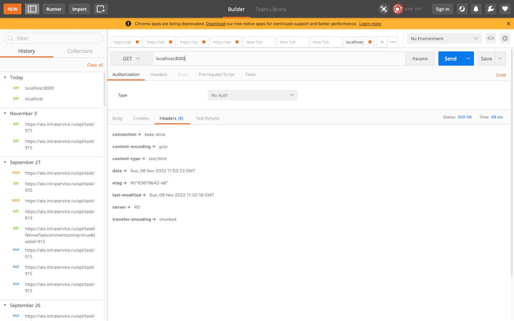
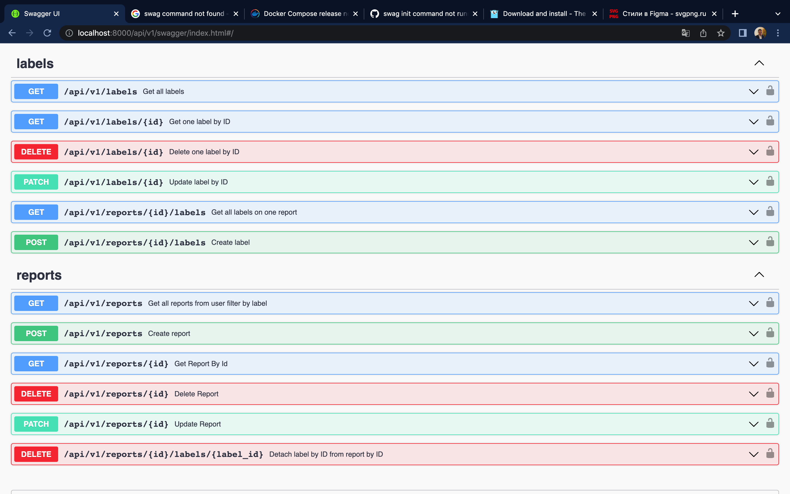
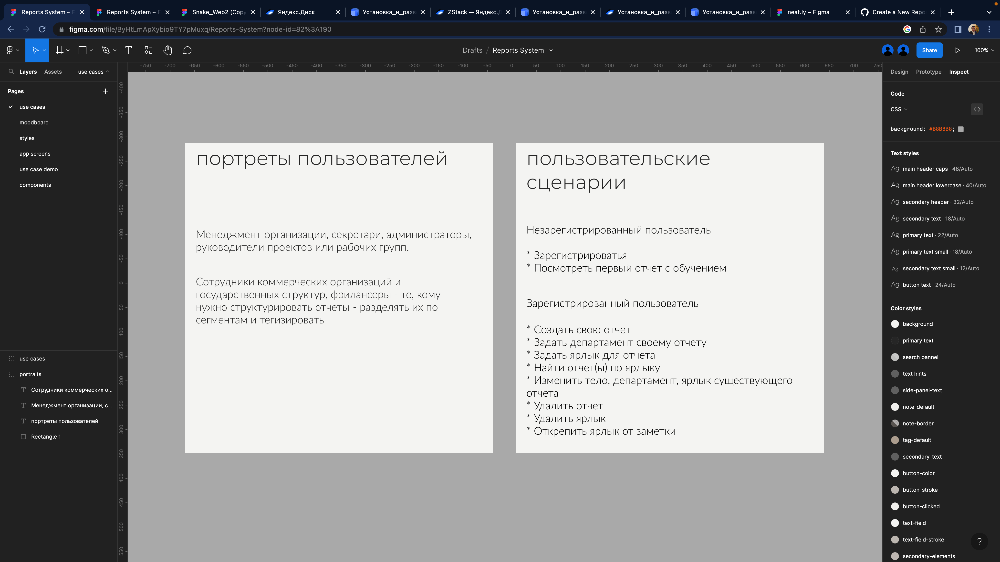
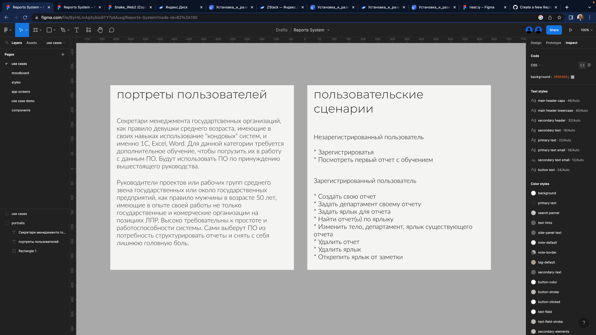

1 ЛР.
- Показать подмену имени сервера
  
- API лейблов поправить
  
  Баллы фиксированы.

2 ЛР.
- Добавить больше характеристик конкретным группам пользователей -> Готово
  
  
- Замена цветов должна работать -> Редактирование поля или компонента ведет к редактированию привязанных копий
- Проверить компоненты -> Проверено
- Адаптив и его границы -> Constrain proportion and desktop-grid
- Поместить департамент понятнее чем сейчас -> Готово
- Отрисовать форму добавления лейбла -> Готово texfield
- Поиск по лейблу добавить в UI -> Готово (как в почте имена почт)
